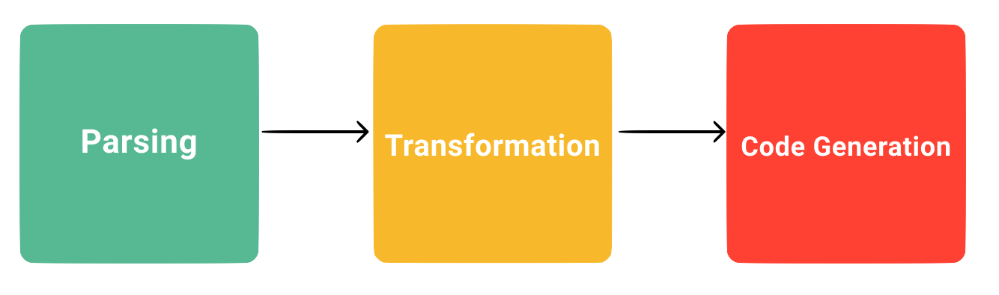
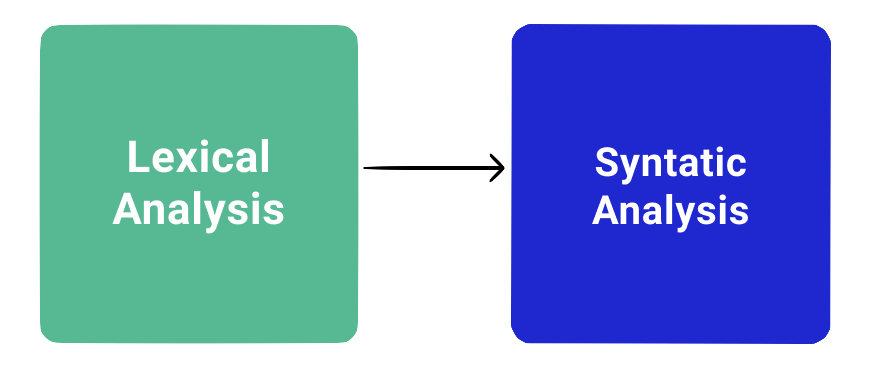
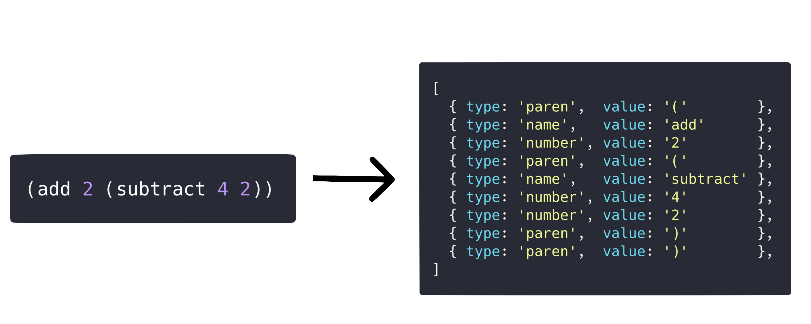
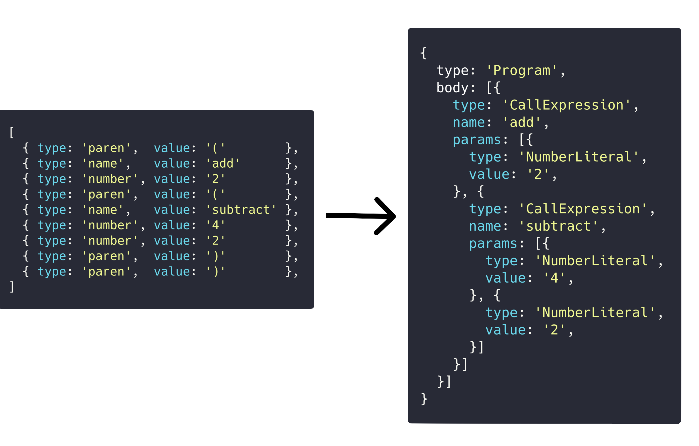
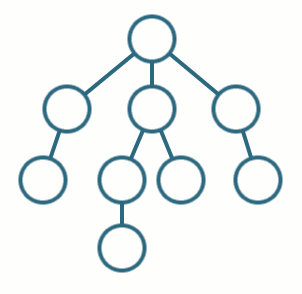
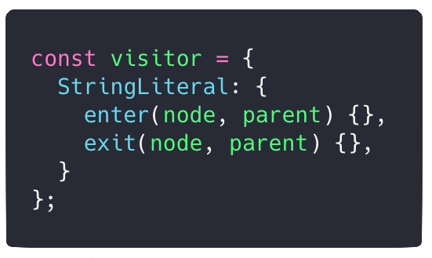

import { Head, Image, Appear } from 'mdx-deck'
import { Split, FullScreenCode } from 'mdx-deck/layouts'
import { CodeSurfer } from "mdx-deck-code-surfer";

import { Cover } from './Cover';
import { Intro } from './Intro';
import { Img } from './Img';
import { InlineImg } from './InlineImg';
import { Thanks } from './Thanks';
import { Feedback } from './Feedback';

export { default as theme } from './theme'

<Head>
  <title>Practical AST</title>
</Head>

<Cover />

---

<Intro />

---

# Overview

<ul>
    <Appear>
        <li>
            Compilers
        </li>
        <li>
            Parsing
        </li>
        <li>
            Transformation
        </li>
        <li>
            Code Generation
        </li>
        <li>
            Pratical AST
        </li>
    </Appear>
</ul>

---

# What is a Compiler

Compilers are programs that transform code in a programming language to another language (low level or machine code)

---

# Compiler Pipeline


---

# Parsing


---

# Lexical Analysis
- It takes raw code and transform it into tokens
- It is called tokenizer or lexer
- Tokens are tiny objects that describe syntax

---

# Tokenizer


---

# Syntatic Analysis
- It takes the tokens
- It reformat then to a representation that describes syntax and their relation one to another
- This representation is called Abstract Syntax Tree or Intermediate Representation.

---

## Syntatic Analysis


---

<CodeSurfer
    title="Abstract Syntax Tree"
    code={`
{
  type: 'Program',
  body: [{
    type: 'CallExpression',
    name: 'add',
    params: [{
      type: 'NumberLiteral',
      value: '2',
    }, {
      type: 'CallExpression',
      name: 'subtract',
      params: [{
        type: 'NumberLiteral',
        value: '4',
      }, {
        type: 'NumberLiteral',
        value: '2',
      }]
    }]
  }]
}
    `}
/>
---

## Transformation
- we can add/remove/replace properties of AST nodes
- we can add/remove/replace nodes
- we can create a new whole AST

---

## Traversal


---

## Visitor Pattern


---

## Code Generation
- It iterate recursively on final AST to print nodes
- It can print machine code
- It can print another language (graphql2ts)
- It can print the same language (prettier)

---

## Pratical AST


---

## [AST Explorer](https://astexplorer.net/)


---

## Where AST is used?
<ul>
    <Appear>
        <li>
            Babel
        </li>
        <li>
            Eslint
        </li>
        <li>
            Prettier
        </li>
        <li>
            GraphQL
        </li>
        <li>
            Relay Modern
        </li>
        <li>
            Codemods
        </li>
        <li>
            IDE
        </li>
        <li>
            Docz
        </li>
        <li>
            And more
        </li>
    </Appear>
</ul>
---

## Babel
- You use Visitor pattern to write babel plugins to transform new javascript to old javascript

---

## Eslint
- You use AST to create custom rules for you codebase

---

## Eslint Selectors
- You can "query" AST node using syntax similar to CSS selectors

```js
CallExpression[callee.name='setTimeout'][arguments.length!=2]
```
---

## Prettier
- You use AST to pretty print your code

---

## GraphQL
- You use AST to handle GraphQL SDL and extend your GraphQL capability

---

## GraphQL2TS
<InlineImg src={'./img/graphql2ts.png'} width={400} />

- Transforms .graphql files into graphql-js typescript code

---

## Relay Modern
- Relay uses GraphQL AST to compile and optimize GraphQL fragments and queries
- It also polyfill GraphQL to enable fragments to have arguments, this provides a better DX without losing performance

---

## Relay Compiler Repl


---

## Codemods
- Codemod is an AST-to-AST transformation to evolve codebase
- Much more powerful than regex
- AST has much more information than raw code

---

## Codemod Examples
- [rn24-rn25](https://github.com/sibelius/codemod-RN24-to-RN25): transform imports from @reactnative v24 style to @reactnative v25 style
- [ast-i18n](https://github.com/sibelius/ast-i18n): transform your raw strings to i18n keys and extract all of them to a locale file
- [rn-deprecated-modules](https://github.com/lucasbento/rn-update-deprecated-modules) by @lbentosilva: transform from react-native import to new @ReactNativeComm packages

---

## Codemod Examples
- [import-codemod](https://github.com/jongold/import-codemod) by @jongold: generic codemod to transform imports
- [react-codemod](https://github.com/reactjs/react-codemod) by @reactjs

---

## References

- [The Super Tiny Compiler](https://github.com/jamiebuilds/the-super-tiny-compiler)
- [The Super Tiny Compiler Glitch](https://the-super-tiny-compiler.glitch.me/)
- [Effective JavaScript Codemods](https://medium.com/@cpojer/effective-javascript-codemods-5a6686bb46fb)
- [LALG Compiler](https://github.com/sibelius/LALG)
- [Writing Javascript Codemods and Understanding AST Easily](https://dev.to/arminaskatilius/writing-javascript-codemods-and-understanding-ast-easily-48fc)

---

## References
- [AST Explorer](https://astexplorer.net/)
- [Babel Handbook](https://github.com/jamiebuilds/babel-handbook)
- [Babel](https://babeljs.io/)
- [Eslint Selectors](https://eslint.org/docs/developer-guide/selectors)
- [Relay Compiler Repl](https://relay-compiler-repl.netlify.com/)

---

## References
- [Unified](https://unified.js.org/)
- [JSCodeshift](https://github.com/facebook/jscodeshift)
- [GraphQL2TS](https://github.com/sibelius/graphql2ts)
- [AST i18n](https://github.com/sibelius/ast-i18n)

---

<Thanks />

---

<Feedback />
